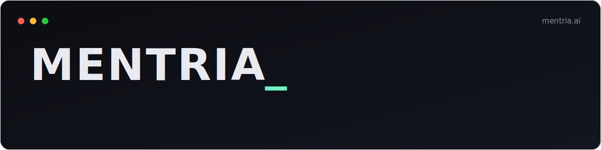

<p align="center">
  <a href="https://mentria.ai">
    
  </a>
</p>

<p align="center">
  🌐 <a href="https://mentria.ai">mentria.ai</a> &nbsp;·&nbsp;
  🧰 <a href="https://mentria.ai/tools/">Tools</a> &nbsp;·&nbsp;
  📡 <a href="https://mentria.ai/feed/">Feed</a> &nbsp;·&nbsp;
  🧩 <a href="https://mentria.ai/tools/extensions/">Extensions</a> &nbsp;·&nbsp;
  💬 <a href="https://mentria.ai/comms/">Comms</a>
</p>

<p align="center">
  <b>A creative studio shipping browser-native AI tools, games, and utilities.</b><br>
  <sub>A from-scratch WebGPU engine runs <b>Qwen3.5 (0.8B · 2B · 4B)</b> locally in your browser — no server, no API key, no account, nothing leaves your device.</sub>
</p>

<table align="center">
  <tr>
    <td align="center" width="240">🧠<br><b>On-device AI</b><br><sub>WebGPU LLM + vision, custom runtime</sub></td>
    <td align="center" width="240">🔌<br><b>Hot-swap LoRA</b><br><sub>Adapters swap at the matmul in &lt;1s</sub></td>
    <td align="center" width="240">🛡️<br><b>Zero servers</b><br><sub>Offline PWA · 5 languages · no telemetry</sub></td>
  </tr>
</table>

<p align="center"></p>

## ✦ The engine

Mentria's inference stack is **its own runtime**, written from scratch against raw WebGPU — not a wrapper around an existing browser-LLM library:

- **WGSL compute shaders** for matmul, with a **fused base + LoRA** path so a 2–8 MB adapter can re-skin the model at the matmul boundary in under a second.
- Qwen3.5's hybrid stack: the **Gated DeltaNet** recurrent state update (Mamba-style linear-attention layers) alongside **grouped-query attention with partial RoPE**.
- A **vision tower** (ViT, also on WebGPU) for image input.

### One shared, hardware-validated model tier

The whole site shares **one model ladder — 0.8B · 2B · 4B**. The first time you open any AI tool, a quick device check loads a model **and runs a real generation to confirm it actually works**, degrading to a smaller tier if it doesn't — then remembers the verdict. A capable device is offered the best model it can run; every AI tool reuses whatever's downloaded. Bigger models are an explicit, one-time choice — never a surprise multi-GB download.

<p align="center"></p>

## 🧰 Tools

**24 browser-native tools and games — all client-side, all offline-capable.**

| | |
|---|---|
| **🧠 AI** | [AI Chat](https://mentria.ai/tools/ai-chat/) (text + vision) · [Annotate Image](https://mentria.ai/tools/annotate-image/) · [Motivational Quote](https://mentria.ai/tools/quote/) · [Search](https://mentria.ai/tools/search/) (AI summaries) · [Markdown → PDF](https://mentria.ai/tools/markdown-pdf/) (AI naming) |
| **🎮 Games** | [Chess](https://mentria.ai/tools/chess/) · [Sudoku](https://mentria.ai/tools/sudoku/) · [Ludo](https://mentria.ai/tools/ludo/) · [Tetris](https://mentria.ai/tools/tetris/) · [Breakout](https://mentria.ai/tools/breakout/) · [Flappy](https://mentria.ai/tools/flappy/) · [Minesweeper](https://mentria.ai/tools/minesweeper/) |
| **🔧 Utilities** | [TOTP](https://mentria.ai/tools/totp/) · [QR Scanner](https://mentria.ai/tools/qr-scanner/) · [Quick Notes](https://mentria.ai/tools/quick-notes/) · [Base64](https://mentria.ai/tools/base64-codec/) · [Color Picker](https://mentria.ai/tools/color-picker/) · [Invoice](https://mentria.ai/tools/invoice/) · [Countdown](https://mentria.ai/tools/countdown-timer/) · [Decision Wheel](https://mentria.ai/tools/decision-wheel/) · [Coin Flip](https://mentria.ai/tools/coin-flip/) · [Step Counter](https://mentria.ai/tools/step-counter/) |
| **📡 More** | [Infinite Radio](https://mentria.ai/tools/radio/) · [Private Extensions](https://mentria.ai/tools/extensions/) (run your own single-file tools) · [Comms](https://mentria.ai/comms/) (P2P chat + file drop) |

<p align="center"></p>

## ⚙️ Stack

Static-first: **[Eleventy 3](https://www.11ty.dev/) + Nunjucks**, vanilla JS, a single runtime dependency. WebGPU for inference. Builds to a flat directory and ships from GitHub Pages. No third-party scripts, self-hosted fonts, 5 languages (en · es · pt-BR · fr · ja).

```bash
npm install
npm run start   # dev server with hot reload → http://localhost:8080
npm run build   # production build → ./build
```

<details>
<summary><b>Repo layout</b></summary>

- `src/_data/` — global data (`site.json`, `tools.json`, i18n)
- `src/_includes/` — Nunjucks layouts
- `src/tools/` — each tool is one self-contained `.njk` file
- `src/feed/` — markdown posts
- `src/assets/` — CSS, JS, the vendored WebGPU engine (`mentria/dist/`)
</details>

<p align="center"></p>

<sub><b>Keywords:</b> browser llm · webgpu llm · on-device llm · qwen in browser · qwen3 webgpu · lora hot-swap browser · client-side ai · private ai chat · webgpu inference engine</sub>

## License

MIT — see [LICENSE](LICENSE).
