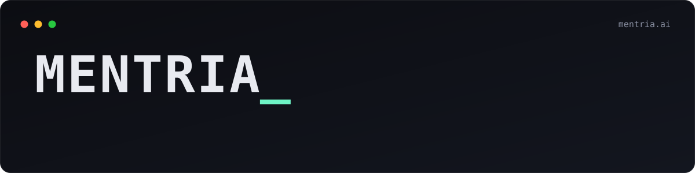
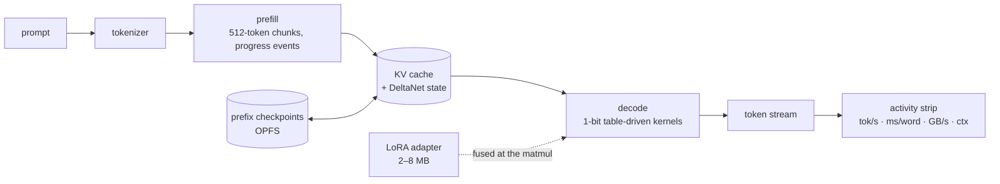

<p align="center">
  <a href="https://mentria.ai">
    
  </a>
</p>

<p align="center">
  🌐 <a href="https://mentria.ai">mentria.ai</a> &nbsp;·&nbsp;
  🧰 <a href="https://mentria.ai/tools/">Tools</a> &nbsp;·&nbsp;
  📡 <a href="https://mentria.ai/feed/">Feed</a> &nbsp;·&nbsp;
  📚 <a href="https://mentria.ai/assets/learn/engine-facts.html">Engine facts</a> &nbsp;·&nbsp;
  📊 <a href="benchmarks/">Benchmarks</a>
</p>

<p align="center">
  <b>A from-scratch WebGPU inference engine, and the tools built on it, running entirely in your browser.</b><br>
  <sub>Qwen3.5 0.8B · 2B · 4B and a natively 1-bit 27B. No server, no API key, no account. Nothing leaves your device.</sub>
</p>

<p align="center">
  <a href="https://github.com/mentria-ai/website/stargazers"></a>
  &nbsp;
  <a href="https://github.com/sponsors/mentria-ai"></a>
  &nbsp;
  <a href="LICENSE"></a>
</p>

<p align="center">
  <a href="https://mentria.ai/tools/ai-chat/">
    
  </a>
</p>

## What this is

- **A 27B model in a browser tab.** Bonsai-27B, natively 1-bit, sits in 3.8 GB of GPU memory and answers at 25–30 tokens/s on a 6 GB RTX 3060 Laptop, about 30 on an M4 Pro. The [engine facts page](https://mentria.ai/assets/learn/engine-facts.html) has the write-up behind every kernel, and [benchmarks](benchmarks/) has the raw runs and how they were measured.
- **One engine, every tool.** The same runtime powers chat with vision, image annotation, search summaries, a console agent, a quote generator and more. A model downloads once and every tool reuses it.
- **Nothing to trust but your browser.** Static site, no third-party scripts, no telemetry, works offline as a PWA in five languages.

## The engine

Written from scratch against raw WebGPU, in WGSL. The code that ships is vendored in `src/assets/mentria/dist/`; every kernel change ships only when its output is byte-identical to the build before it.


```mermaid
flowchart LR
  P[prompt] --> T[tokenizer]
  T --> F["prefill<br/>512-token chunks, progress events"]
  F --> K[(KV cache<br/>+ DeltaNet state)]
  K --> D["decode<br/>1-bit table-driven kernels"]
  D --> S[token stream]
  S --> A["activity strip<br/>tok/s · ms/word · GB/s · ctx"]
  C[(prefix checkpoints<br/>OPFS)] <--> K
  L[LoRA adapter<br/>2–8 MB] -. fused at the matmul .-> D
```

- **1-bit decode.** Four 1-bit weights have sixteen possible partial sums, so the kernel computes them once into on-chip scratch and each row reads its answer from that table. With a bank-conflict skew it runs the 27B at 32 tokens/s on a 6 GB laptop card ([station 258](https://mentria.ai/assets/learn/engine-facts.html#s258), [259](https://mentria.ai/assets/learn/engine-facts.html#s259)).
- **Hybrid attention.** Qwen3.5's Gated DeltaNet recurrent layers alongside grouped-query attention with partial RoPE; only the 16 attention layers keep a cache, at 128 KiB per token.
- **Memory that fits the card.** One snapshot slot, pool trimming and a write-buffer upload path keep the 27B under a 6 GB budget with a 3,072-token window; Apple GPUs get 8,192 with a half-precision cache.
- **Prefix checkpoints.** Long conversations are checkpointed to the origin's private file system, so a side question, a router ask or a page reload restores the processed prefix in under half a second instead of re-reading everything.
- **Hot-swap LoRA.** Adapters of a few megabytes are fused at the matmul and switch in under a second.
- **A vision tower** on WebGPU for image input, and an **activity strip** on every AI page showing the honest numbers for each slow phase: download, upload to GPU, prompt reading, answering.

| Device | Model | Decode | Context |
|---|---|---|---|
| RTX 3060 Laptop, 6 GB, Windows, Chrome | Bonsai-27B 1-bit | 25–30 tok/s | 3,072 |
| M4 Pro, 24 GB, macOS, Chrome | Bonsai-27B 1-bit | ~30 tok/s | 8,192 |
| Flagship Android, Adreno 8xx | Qwen3.5 4B | 10–11 tok/s | 2,048 |

> [!NOTE]
> Chrome and Edge on Windows and macOS are the tested paths. Chrome on Android runs the small tiers. Firefox works slowly on the small tiers only, because it charges about ten times more per submitted command buffer. Safari is untested. The 27B is offered only where the GPU qualifies.

## Tools

Thirty-five client-side tools and games, all offline-capable.

| | |
|---|---|
| **🧠 AI** | [AI Chat](https://mentria.ai/tools/ai-chat/) (text, vision, web search) · [Console](https://mentria.ai/tools/console/) (the 27B operating the site's tools for you) · [Annotate Image](https://mentria.ai/tools/annotate-image/) · [Model Mirror](https://mentria.ai/tools/model-mirror/) · [Motivational Quote](https://mentria.ai/tools/quote/) · [Search](https://mentria.ai/tools/search/) · [Infinite Radio](https://mentria.ai/tools/radio/) |
| **🎮 Games** | [Chess](https://mentria.ai/tools/chess/) · [Sudoku](https://mentria.ai/tools/sudoku/) · [Ludo](https://mentria.ai/tools/ludo/) · [Tetris](https://mentria.ai/tools/tetris/) · [Breakout](https://mentria.ai/tools/breakout/) · [Flappy](https://mentria.ai/tools/flappy/) · [Minesweeper](https://mentria.ai/tools/minesweeper/) · [PHOSPHOR](https://mentria.ai/tools/phosphor/) |
| **🔧 Utilities** | [Markdown → PDF](https://mentria.ai/tools/markdown-pdf/) · [QR & Barcode](https://mentria.ai/tools/qr-scanner/) · [TOTP](https://mentria.ai/tools/totp/) · [EXIF Inspector](https://mentria.ai/tools/exif/) · [Quick Notes](https://mentria.ai/tools/quick-notes/) · [Invoice](https://mentria.ai/tools/invoice/) · [Countdown](https://mentria.ai/tools/countdown-timer/) · [Files](https://mentria.ai/tools/files/) · [Base64](https://mentria.ai/tools/base64-codec/) · [Color Picker](https://mentria.ai/tools/color-picker/) · [Decision Wheel](https://mentria.ai/tools/decision-wheel/) · [Coin Flip](https://mentria.ai/tools/coin-flip/) |
| **📱 Sensors** | [Bubble Level](https://mentria.ai/tools/bubble-level/) · [Decibel Meter](https://mentria.ai/tools/decibel-meter/) · [Compass](https://mentria.ai/tools/compass/) · [GPS Speedometer](https://mentria.ai/tools/speedometer/) · [Ruler](https://mentria.ai/tools/ruler/) · [Step Counter](https://mentria.ai/tools/step-counter/) |
| **🔗 Together** | [Comms](https://mentria.ai/comms/) (end-to-end encrypted P2P rooms, files, markdown) · [Extensions](https://mentria.ai/tools/extensions/) (run your own single-file tools, never uploaded) |

## Run it locally

```bash
npm install
npm run start   # dev server with hot reload → http://localhost:8080
npm run build   # production build → ./build
```

[Eleventy 3](https://www.11ty.dev/) + Nunjucks, vanilla JS, one runtime dependency. Pushes to `main` deploy to GitHub Pages. The model weights come from a CDN on first use and stay in the browser's cache.

<details>
<summary><b>Repo layout</b></summary>

- `src/_data/` — site data, the tool catalog, i18n (en · es · pt-BR · fr · ja)
- `src/_includes/` — Nunjucks layouts
- `src/tools/` — each tool is one self-contained `.njk` file
- `src/feed/` — posts
- `src/assets/mentria/dist/` — the vendored WebGPU engine, with `THIRD_PARTY_LICENSES.md`
- `src/assets/js/mentria-tiers.js` — the model ladder and per-GPU policy; `mentria-model.js` — the shared loader and first-run device check; `mentria-activity.js` — the activity strip
- `benchmarks/` — raw exports from the public bench page
</details>

<details>
<summary><b>Model ladder</b></summary>

The site shares one ladder: 0.8B · 2B · 4B · 27B. On the first visit a device check loads the best model the hardware qualifies for and runs a real generation to prove the route works, dropping a tier if it does not, then remembers the verdict. Bigger models are an explicit one-time choice, never a surprise download, and the check can be sent to the background or stopped at any point.
</details>

## License

MIT — see [LICENSE](LICENSE). The 1-bit 27B repack and its evaluation are at [huggingface.co/mentriaai/Bonsai-27B-mentria](https://huggingface.co/mentriaai/Bonsai-27B-mentria).
